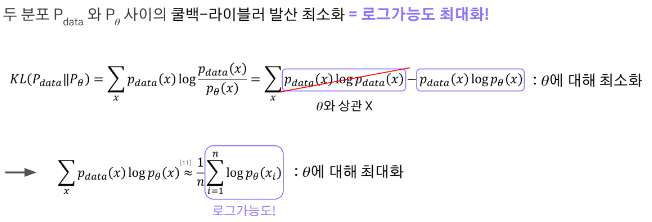
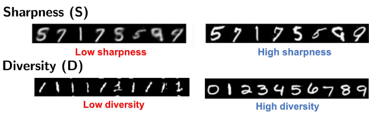
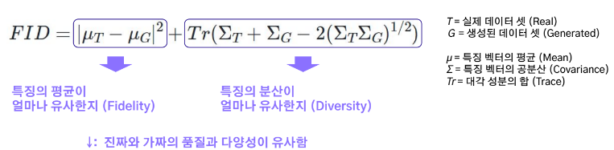

# 생성모델의 발전과정

## 1. 2013년 이전

### 1.1 생성모델이란?

데이터는 저차원의 **필수적인 정보로부터 생성 가능하다는 가정**하에 분포를 학습, 새로운 데이터를 생성

### 1.2 고전 생성 모델

확률 분포 추정과 근사

- 가우시안 혼합모델
- 제한된 볼츠만 머신
- 심층 신뢰망
- 자기 회귀

## 2. 2014년 이후

### 2.1 딥러닝 기반의 생성 모델

변분 오토 인코더 (VAE)와 적대적 생성 신경망(GANs)이 발전했다.

### 2.2 변분 오토 인코더의 발전

학습이 간단하고 기반이 단단하다.

다만, 결과물이 흐릿하다는 단점이 있었다.

이를 개선하기 위해서 잠재 분포를 개선하고, 계층모형을 추가하는 것으로 만들었다.

### 2.3 적대적 생성 신경망의 발전

모델이 만든 데이터와 실제 데이터를 classifier를 이용해서 경쟁적으로 데이터를 생성시킨다..

다만 경쟁적이다보니 학습 결과가 매우 부정적이라는 문제점도 존재

하지만 GANs는 산수와 같은 방법으로 데이터를 만들어서 특정 feature를 합치거나 빼면서 생성할 수 있다.

### 2.4 확산 모델의 발전

열확산 현상 이론을 도입한 모델이다.

원래는 매우 생성이 느렸지만 이를 개선하는 연구가 진행됨

# 판별모델과 생성모델

## 1. 판별모델과 생성모델

### 1.1 판별모델

데이터 X가 주어졌을 때, 특성 Y가 나타날 조건부 확률($p(Y\|X)$)을 직접적으로 반환하는 모델

주어진 데이터를 통해 데이터 사이의 경계를 예측을 한다.

ex. 로지스틱 회귀분석

---

활용

- 어떤 데이터를 서로 다른 클래스로 분류해주는 문제에 활용될 수 있음
- 정상 데이터에 대한 경계를 최대한 좁혀 이를 벗어나는 이상치를 감지하는 문제에도 활용가능

### 1.2 생성모델

데이터 X와 특성 Y의 결합 분포 ($p(X,Y)$) or Y가 주어질 때 X의 조건부 분포 ($p(X\|Y)$)를 추정하는 모델

주어진 Y가 없으면, 데이터 주변 분포 p(X)를 추정하는 모델

즉 주어진 데이터를 통해 데이터 분포를 학습한다

ex. 가우시안 혼합 모델 (GMM)

---

어려운 점

1. 고차원 데이터를 모델링 
복잡한 모든 특성의 분포를 알아야한다. 
이는 데이터는 **저차원의 정보로 표현할 수 있다**는 가정을 활용한다.
2. 평가지표 
판별 모델과 달리 생성된 데이터에 대한 정량적 평가가 어렵다 
ex. 더 잘 생성한 얼굴 사진은 무엇이고, 이를 평가하는 지표는 무엇인가??

---

활용

- 이미지의 품질개선
- 맥락에 맞게 이미지 빈 공간 자동완성
- Image Inpainting

# 생성모델 활용사례

## 1. 생성 모델 활용 사례

### 1.1 실생활 응용

#### 화질 개선

저화질 영상의 화질을 개선한다. 노이즈 제거도 여기에 포함

#### 오래된 사진 복구

다양한 잡음이 낀 영상을 깔끔한 이미지로 복원

#### AI 프로필

10~20 장 기반의 프로필 생성

#### Webtoon AI Painter

스케치를 원하는 색상으로 자연스럽게 자동 채색하는 툴

#### 상품사진 생성

일반적으로 촬영한 사진을 상품 소개 사진처럼 바꿔주는 툴

#### 가상 옷 피팅

주어진 사람과 옷을 합성하는 기술

#### 텍스트 기반 영상 생성(Midjourney)

텍스트를 입력받아 사실적인 묘사, 추상적 표현을 풍부하게 생성하여 예술 부분에 특화된 생성 모델

#### 춤추는 영상 생성

실존인물을 입력으로 받아 해당 인물이 춤추는 영상 생성

#### 오디오 기반 비디오 합성

한장의 사진과 음성으로 입력 사진에 해당하는 사람이 말하는 동영상 합성

#### AI 더빙

동영상 번역과 이에 맞게 입모양을 만들어주는 제품

#### 가상 아바타와 동영상 생성

텍스트를 사람이 말하는 영상으로 변환해주는 제품

#### AI 음악 생성

기존 음성 소스를 활용, 새로운 음악과 입히는 방식의 음악 생성

#### Gen-2 (Runway AI)

다양한 입력 기반 동영상 생성 및 편집 툴

#### ClipDrop (Stability AI)

다양한 이미지 편집 기능 제공

# 생성 모델과 최대 가능도 추정

## 1. 생성모델

### 1.1 remind: 생성모델

주어젠 데이터를 통해 데이터 분포를 학습하는 모델

### 1.2 최대 가능도 추정법

**가능도(likelihood)와 로그가능도(Log-likelihood)**

모델 파라미터 $\theta$에 의존하는 분포 $p(x; \;\theta)$를 따르는 n개의 데이터 $x_1, x_2, ..., x_n$ 관찰

데이터로부터 모델 파라미터 $\theta$를 어떻게 추정하는가 $\rightarrow$ 가능도를 최대화하는 파라미터를 찾자

이때 로그 가능도를 활용하는 이유는, 가능도 계산에서의 곱연산이 합연산으로 바뀌게 되고 (log의 특성) 이때문에 미분의 계산을 더 빠르게 진행할 수 있기 때문 (수식적 해석도 쉬워진다)

**최대 가능도 추정법**

>ex. 동전던지기
>
>관측치 : head 7, tail 3 
>파라미터 $\theta$ : 동전을 던질 때 앞면이 나올 확률
>확률질량함수 : $p(앞면; \theta) = \theta, \; p(뒷면; \theta) = 1- \theta$ 
>가능도 최대화 = **어떤 $\theta$에 대해 head 7, tail 3이 나올 확률이 가장 클까?**

### 1.3 생성 모델과 최대 가능도 추정법

#### 생성모델의 학습

데이터의 분포 $P_{data}$를 어떻게 모델링할까? = 모델 $P_{\theta}$를 어떻게 학습할까?

$\rightarrow$ 데이터 분포 $P_{data}$와 모델 $P_{\theta}$를 가깝게 하자!

---

**쿨백-라이블러 발산** (Kullback-leibler Divergence, KL-Divergence)

분포 간 차이를 측정하는 대표적인 바업ㅂ

두 분포 $P_{data}$와 $P_{\theta}$ 사이의 *거리*

단, 이때 거리는 이해를 쉽게 하기 위해 거리라고 표현을 했지만, 대칭성을 가지지 않아 거리라고 말할수는 없다. 다만 두 분포의 차이를 확인하는 수단이라고 이해하는 점이 좋다.

---

결국 **생성모델의 학습은 쿨백-라이블러 발산을 최소화**하는 것으로 귀결된다.

#### 생성 모델의 학습의 어려움

우리는 $P_{data}$를 모르고 관측치만 관측하기 때문에 <mark>관측치를 이용해서 모델이 학습하는 방법</mark>을 알아야한다.

# 생성 모델 평가 지표의 필요성

## 1. 생성 모델 평가 지표의 필요성

### 1.1 판별 모델의 평가 지표

종류

판별 모델은 정답(Ground Truth)이 존재해서 모델의 출력을 정답과 비교하기 쉽다.

범주형 데이터를 사용하는 경우(분류)와 연속형 데이터를 사용하는 경우(회귀)로 나뉜다.

범주형 : 정확도를 많이 활용 
클래스 데이터가 불균형하면 Precision, Recall, F-score등을 사용해서 정확도의 단점을 보완할 수 있다.

연속형 : MSE, MAE가 있음 
주어진 데이터 값의 범위가 다른 경우, MSE와 MAE만으로 평가할 수 없음 
이 경우, 결정 계수 (R-Squared), 상관계수를 사용한다.

### 1.2 생성 모델 평가의 어려움

비교할 정답이 존재하지 않아 결과를 직접적으로 비교할 대상이 없음

훈련 데이터를 정답으로 사용하면, 훈련 데이터를 그대로 복제하는 현상이 발생한다.

그렇다고 사람이 평가를 하게 되면 주관이 들어가게 된다.

여전히 사람을 이용한 평가는 굉장히 유용하며 많이 사용하게 된다. 
하지만 전문성이 요구되는 분야에는 적용하기 어렵다.

따라서 개인의 주관이 개입되지 않고, 연구자들이 공감할 수 있는 객관적인 지표가 필요하다.

- 생성된 결과물의 품질
- 생성된 결과물의 다양성

---

평가지표

- Inception Score
- Frechet Inception Distance
- 개선된 정밀도, 재현율
- 조건부 정확도

등등

# 생성 모델의 평가 지표 (IS % FID)

## 1. 생성 모델의 평가 지표 (IS % FID)

### 1.1 Evaluate What?

어떤 항목들을 평가해야하는가?

고려할 점은 2가지

- 충실도 : 이미지의 품질
- 다양성 : 이미지의 다양성

---

단순한 방법으로는 훈련에 사용한 원본 데이터와 생성된 결과물을 비교하는 것

그러나 비교할 때, 픽셀 별 거리를 최소화하는 방법으로 비교하게 되면 훈련 데이터를 복제하게 된다.

따라서 비교할 때, 추상적인 특징만을 뽑아내어, 그 특징이 잘 적용이 되어있는지만을 훈련 데이터와 비교한다.

### 1.2 Inception Score(IS)

Inception v3 모델을 분류기로 이용하여 GAN을 평가하기 위해 고안된 지표

예리함과 다양성 두 가지를 주요하게 고려

---

**Entrophy**

엔트로피가 높음 $\rightarrow$ 임의의 변수 x에 대해 예측되는 y의 값이 많음 $\rightarrow$ 예측이 어려움

엔트로피가 낮음 $\rightarrow$ 임의의 변수 x에 대해 예측되는 y의 값이 적음 $\rightarrow$ 예측 가능

---

**예리함** (Sharpness)

특정 숫자 (9)를 생성했을 때, 숫자 분류기가 제대로 인식한다면 좋은 예리함을 가진 데이터를 생성한 것이다.

---

**다양성** (Divergence)

좋은 품질의 데이터를 생성하는 것만큼, 다양한 데이터를 생성하는 것도 중요하다.

---

Inception Score 계산

$IS = Sharpness(S) \times Diversity(D)$

단순하지만 사람이 내리는 판단 기준과 상관계수가 높다.

---

**한계점**

1. 확률을 기반으로 평가하기 때문에, 클래스에 속하는 확률 계산이 안되는 dataset에 대해서는 적용할 수 없다. 
예를 들어 사람 사진을 생성할 경우, 제대로 생성되지 않은 사람의 사진이라도 분류기는 사람으로 분류하게 되므로 IS가 높게 나오더라도 사용할 수 없는 데이터가 된다.
2. 같은 데이터 or 같은 class의 데이터만 많이 만들어도 Diversity를 매우 높게 설정하는 경우도 있다. 
3. 또한 매우 노이즈가 심한 경우에도 높은 점수를 받을 수 있고, 매우 잘 만든 사진 데이터에 대해서도 낮은 점수를 받을 수 있다.

### 1.3 Frechet Inception Distance (FID)

IS의 한계점을 보완하고자, 데이터의 확률 벡터가 아닌 특징 벡터만을 사용

FID는 거리이므로 낮을 수록 좋다고 할 수 있다.

---

**계산**

FID는 훈련 데이터와 생성 데이터를 모두 사용한다.

훈련 데이터와 생성데이터의 분포를 정규 분포로 가정하고 이 분포의 거리가 Gaussian Distance를 따른다는 이전의 연구 결과를 활용한다.

---

**한계점**

데이터셋의 제약이 없으나, Fidelity와 Diversity를 각각 평가할 수 없다.

Fidelity가 강조된 모델인지, Diversity가 강조된 모델인지 알수가 없다는 한계점이 있다.

# 생성 모델의 평가 지표 (정밀도 & 재현율)

## 1. 생성 모델의 평가 지표 (P&R)

### 1.1 FID의 한계

충실도 (Fidelity) vs 다양성 (Diversity)

FID만으로는 모델이 품질에 집중했는지, 다양성에 집중했는지 판단할 수 없음

### 1.2 P&R

Precision (정밀율) : 모델이 양성이라고 예측할 때, 실제 양성일 확률

Recall (재현율) : 실제로 양성일 때, 모델이 양성이라고 예측할 확률

이를 생성 모델의 영역으로 그대로 끌고오면

Precision : 생성된 데이터 분포 중에서 실제 데이터 분포에 아주 가까운 데이터

Recall : 실제 데이터 중에서 생성된 데이터 분포에 아주 가까운 데이터

### 1.3 개선된 정밀도 & 개선된 재현율

그러면 이걸 사용하기 위해선 분포의 겹치는 범위를 계산할 수 있어야한다.

**근방** (Close to) : K-NN radii에서 정의된다. 
어떤 데이터(분포) a가 있을 때, a와 가장 가까운 데이터(분포)와의 거리를 반지름으로 하는 원의 구역을 의미한다.

---

**Improved Precision 계산**

실제 데이터 분포 내의 생성된 데이터 / 생성된 데이터

**Improved Recall 계산**

생성된 데이터 분포 내의 실제 데이터 / 실제 데이터

### 1.4 한계점

1. 이상치에 매우 민감하다. 
일부 데이터의 임베딩 위치가 변해도 값이 매우 크게 변한다. 
즉, 평가 지표로서 불안정하다.
2. 실제 데이터와 생성된 데이터의 분포가 동일해도 샘플링에 따라 점수가 낮을 수 있다.
3. 훈련 과정에서 일부 모드가 사라지더라도 이에 덜 민감하게 반응한다.
4. 계산량이 많다. 
매 계산시 생성된 manifold(특징)을 알아야 하고, 반지름 k 이내의 데이터들을 계산해야한다.
5. 매개변수(거리, 데이터 위치 등)에 민감하다.

---

**문제 완화**

Density : 반경의 합집합이 아닌 가중 합집합으로 계산해서 이상치에 대해 상대적으로 덜 민감하게 변경

Coverage : 생성된 데이터에 대해 매번 계산하지 않고, 실제 데이터 집합으로 미리 계산하여 안정적이고 계산량 감소

# 생성 모델의 평가 지표 (조건부 생성 모델)

## 1. 조건부 생성 모델

### 1.1 조건부 생성 모델

일반 생성 모델은 데이터 분포 p(X)를 학습하기 때문에 생성되는 데이터의 의미를 제어할 수 없음

**조건부 생성 모델** : 레이블이 주어졌을 때 제이터의 분포 p(X\|Y)를 학습 
특정 조건(숫자,스타일)을 만족하는 데이터를 생성할 수 있다.

---

**평가**

IS, FID는 조건부 생성을 고려하지 않았음 
조건에 맞지 않아도 충분히 다양하고 품질이 높다면 그냥 좋은 모델로 평가했다.

## 2. 분류 정확도 기반 평가 지표

### 2.1 Intra FID

특정 클래스 내의 영상과 특정 클래스를 조건으로 생성된 영상들끼리 계산되는 FID이다.

### 2.2 사전훈련된 분류기의 정확도

생성된 영상의 조건에 대한 특징을 반영한 정도를 측정한다.

1. 분류기를 사전학습하고
2. 새로운 데이터를 생성한다.
3. 그다음 생성한 영상에 대해서 측정을 해 정확도를 확인한다.

---

**한계점**

1. 사전 훈련된 분류기에 크게 의존한다.
2. 조건부 생성을 제대로 못해도 분류기의 분류 경계만 넘으면 정확도가 오른다.
3. 다양한 영상을 만들지 않고, 하나의 영상만 계속 만들어도 정확도가 오른다.

### 2.3 CAS (Classification Accuracy Score)

1. 새로운 데이터를 생성하고
2. 새로운 데이터를 활용해서 분류기를 학습한다.
3. 그 다음 테스트 셋에 대한 정확도를 측정한다.

사전 훈련된 분류기의 정확도와 반대의 과정을 거친다.

---

**한계점**

생성 모델마다 분류기를 따로 학습해야해서 자원이 소요된다.

### 2.4 LPIPS

Learned Perceptual Image Patch Similarity

모델 특징 비교를 통해서 영상간 유사도를 측정한다.

유사도를 측정하는 것은 Pre-trained 된 분류기에서 사용하는 특성 사이의 유사도를 측정하면 이게 결국 사람이 사진을 보고 유사하다고 판별하는 것과 비슷하다는 아이디어로 접근

즉 Feature space를 이용해서 영상간 유사도를 측정하는 것이다.

이를 이용해서 유사도를 측정해서 다양성을 확인할 수 있다. 
원본 영상과 유사도가 낮다 = 더욱 다양하게 생성했다 라고 해석한다. 
유사도가 높으면 같은 데이터를 복사했다고 의심도 해볼 수 있다.

### 2.5 CLIP Score

**CLIP** : Text에서 encoder를 이용해서 feature를 찾아온다.

Text와 Image 간의 유사도 측정

CLIP에서 얻은 text에서의 feature를 찾고, image encoder를 통과해서 얻은 image feature를 서로 비교해서 그 유사도를 측정한다.

이때 text는 그 사진 class에 대해 설명이 된 text이다.

ex. text : 개는 네 발이 있고 주둥이가 길고 귀가 넓적하다.

# 오토 인코더의 이해

## 1. 오토 인코더

### 1.1 오토 인코더

## 2. 디노이징 오토 인코더

### 2.1 디노이징 오토 인코더

## 3. 오토 인코더의 활용

### 3.1 특징 추출

### 3.2 이상치 탐지