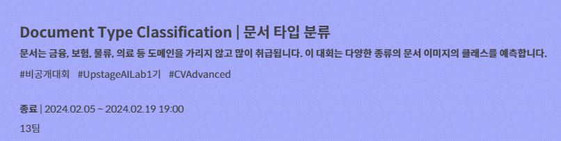
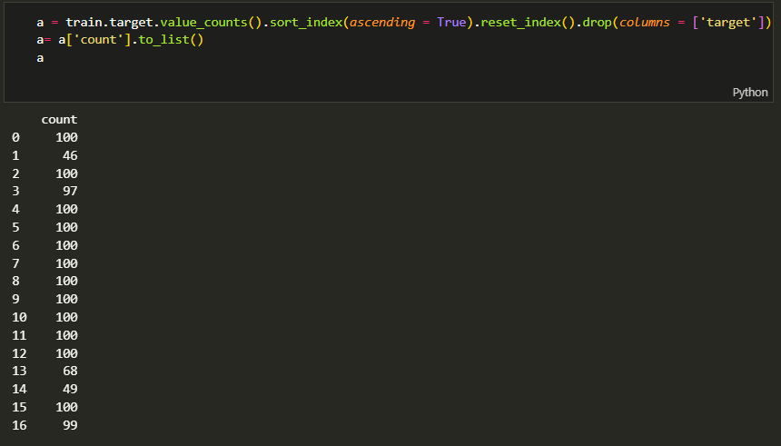

## 1. Abstract

**Goal of the Competition**<br>


해당 대회의 상위권 진출을 목표로 함
    

**Timeline**

- FEbruary 1, 2024 - First Mentoring
- February 2, 2024 - 해당 대회와 비슷한 도배 하자 유형 분류 경진대회를 확인하고, 해당대회의 baseline model 코드를 공부하며, image classification에 대한 이론 공부<br>
추가적으로 멘토님들에게 CV와 관련된 논문을 추천받아 읽어보기
- February 5, 2024 - Start Date
- February 6, 2024 - Data 및 class에 대한 정보 EDA
- February 7, 2024 - Augmentation에 대해 공부 후 이를 모델에 적용해보기<br>
Second Mentoring
- February 8, 2024 - 1주차 중간 정산
- February 13 ~ 16, 2024 - 모델링 및 전처리에서 여러 실험을 적용하여 성능 개선
- February 16, 2024 - 2주차 중간 정산
- February 18, 2024 - 팀원 의견 조율 및 최종 제출 모델 확인
- February 19, 2024 - Final submission deadline
    

## 2. Process : Competition Model

#### 사용 Library

```python
import os
import time
import random
from shutil import copytree, move
import timm
from PIL import Image
import torch
import torchvision
import albumentations as A
import pandas as pd
import numpy as np
import torch.nn as nn
from albumentations.pytorch import ToTensorV2
from torch.optim import Adam
from torchvision import transforms
from torch.utils.data import Dataset, DataLoader
from PIL import Image
from tqdm import tqdm
from sklearn.metrics import accuracy_score, f1_score
from sklearn.model_selection import KFold
import cv2
```

#### meta data

|target|class_name                                           |
|:------:|:-----------------------------------------------------|
|0     |account_number                                       |
|1     |application_for_payment_of_pregnancy_medical_expenses|
|2     |car_dashboard                                        |
|3     |confirmation_of_admission_and_discharge              |
|4     |diagnosis                                            |
|5     |driver_lisence                                       |
|6     |medical_bill_receipts                                |
|7     |medical_outpatient_certificate                       |
|8     |national_id_card                                     |
|9     |passport                                             |
|10    |payment_confirmation                                 |
|11    |pharmaceutical_receipt                               |
|12    |prescription                                         |
|13    |resume                                               |
|14    |statement_of_opinion                                 |
|15    |vehicle_registration_certificate                     |
|16    |vehicle_registration_plate                           |

#### 사용모델

timm에서 **EfficientNet_v2**를 불러와 사용함

```python
model = timm.create_model(model_name,
                            pretrained=False,
                            num_classes=17
                            ).to(device)
```

Loss는 **Focal Loss***를 활용

```python
loss_fn = torch.hub.load(
        'adeelh/pytorch-multi-class-focal-loss',
        model='focal_loss',
        alpha=a,
        gamma=2,
        reduction='mean',
        device='cuda:0',
        dtype=torch.float32,
        force_reload=False)
```

Optimizer는 **Adam** 사용, LR은 **CosineAnnealingWarmRestarts를 이용해 1e-4에서 1e-6사이**의 값을 가지도록 설정


## 3. Process : Issues

**Describe the issue that your team faced during the project.**<br>
1. 몇몇 train data에 labeling이 잘 되어 있지 않은 경우가 있음
2. train data에서 class imbalance가 존재했음
3. test data는 원본 사진이 아닌 이미 augmentation이 적용되어있음
4. test data에는 mixup이 적용된 데이터도 포함이 되어있음

**Describe the possible solution to imporve your project.**<br>
1. 몇몇 train data에 labeling이 잘 되어 있지 않은 경우가 있음<br>
train data를 class 별로 나누어 폴더로 정리한 후에, 하나하나 확인하면서 class에 어긋난 데이터가 있는지 확인을 했음. 그리고 라벨링이 잘못된 데이터는 augmentation 과정 이전에 데이터를 삭제함으로써 모델의 학습에 해당 데이터가 관여하지 못하도록 함
2. train data에서 class imbalance가 존재했음<br>
<br>
앞에서 라벨링이 맞지 않아 삭제한 데이터도 있고, 이미 제공된 데이터 상에서도 class imbalance가 존재했음. 이러한 점을 토대로 Focal Loss를 이용해서 적은 데이터에 대한 모델의 예측에 가중치를 주어 해결하고자 했으며, 실험 중에 혹시나 성능에 차이가 있을까 하여 Up-sampling을 통해 데이터의 밸런스를 맞추는 것도 실험해 보았음
3. test data는 원본 사진이 아닌 이미 augmentation이 적용되어있음<br>
test data는 이미 augmentation이 적용이 되어있는 이미지로 구성되어있음. 그 augmentation은 Flip, Rotate, Contrast, Noise 등 다양한 augmentation이 이미 적용.<br>
따라서 train data의 augmentation에 test에 존재하는 augmentation을 기본 전제로 깔고, 다른 augmentation의 조합을 추가해서 학습하는 것을 목표로 함
4. test data에는 mixup이 적용된 데이터도 포함이 되어있음<br>
Mixup이 잘못된 것은 아니지만, 서로 다른 class에 대한 mixup이 되어있어 해당 data의 Ground Truth를 예측하는 것이 어려운 점이었음. 다만 alpha 값이 달랐으므로, 가장 진하게 보이는 사진의 class를 예측하는 방향으로 갈피를 잡고 train data에 mixup을 감행함

    
## 4. Role

**Describe your role with task in your team.**<br>
FastCampus UpstageAI CV Competition Team Leader, 데이터 EDA, 모델링, Offline Augmentation<br>
(notion. 각자 EDA와 모델링을 진행하고 그 insight를 공유하는 식으로 대회를 진행하여, 서로 다른 모델을 만들었음)


**Describe papers or book chapeters you found relevant to the problem, references to see.**
https://scikit-learn.org/
https://pytorch.org/hub/
https://pytorch.org/docs/stable/index.html
https://albumentations.ai/docs/api_reference/augmentations/transforms/
https://dacon.io/codeshare/2373
https://dacon.io/codeshare/3658
https://ko.d2l.ai/chapter_deep-learning-basics/
https://github.com/Bjarten/early-stopping-pytorch/blob/master/pytorchtools.py


**Explain which are relevant for your Project.**<br>
위의 참조 문헌 모두 참고하면서 modeling을 함

    

## 5. Results

**Write the main result of Competition**<br>
- 결과(개인)<br>
Public Score : 0.8205<br>
Private Score : 0.8261
- 결과(팀)<br>
Public Score : 0.9303<br>
Private Score : 0.9183

**Final standings of the Leaderboard**

6등 기록
    

## 6. Conclusion

**Describe your running code with its own advantages and disadvantages, in relation to other groups in the course.**

필요 라이브러리 import

```python
import os
import time
import random

import timm
import torch
import albumentations as A
import pandas as pd
import numpy as np
import torch.nn as nn
from albumentations.pytorch import ToTensorV2
from torch.optim import Adam
from torchvision import transforms
from torch.utils.data import Dataset, DataLoader
from PIL import Image
from tqdm import tqdm
from sklearn.metrics import accuracy_score, f1_score
from sklearn.model_selection import KFold
import cv2
```


```python
# 시드를 고정합니다.
SEED = 42
os.environ['PYTHONHASHSEED'] = str(SEED)
random.seed(SEED)
np.random.seed(SEED)
torch.manual_seed(SEED)
torch.cuda.manual_seed(SEED)
torch.cuda.manual_seed_all(SEED)
torch.backends.cudnn.benchmark = True
```


```python
class ImageDataset(Dataset):
    def __init__(self, csv, path, transform = None):
        self.df = pd.read_csv(csv).values
        self.path = path
        self.transform = transform
    
    def __len__(self):
        return len(self.df)
    
    def __getitem__(self, idx):
        name, target = self.df[idx]
        img = np.array(Image.open(os.path.join(self.path, name)))
        if self.transform:
            img = self.transform(image=img)['image']
        return img, target

```


```python
class EarlyStopping:
    """Early stops the training if validation loss doesn't improve after a given patience."""
    def __init__(self, patience=7, verbose=False, delta=0, path='checkpoint.pt', trace_func=print):
        """
        Args:
            patience (int): How long to wait after last time validation loss improved.
                            Default: 7
            verbose (bool): If True, prints a message for each validation loss improvement. 
                            Default: False
            delta (float): Minimum change in the monitored quantity to qualify as an improvement.
                            Default: 0
            path (str): Path for the checkpoint to be saved to.
                            Default: 'checkpoint.pt'
            trace_func (function): trace print function.
                            Default: print            
        """
        self.patience = patience
        self.verbose = verbose
        self.counter = 0
        self.best_score = None
        self.early_stop = False
        self.val_loss_min = np.Inf
        self.delta = delta
        self.path = path
        self.trace_func = trace_func
    def __call__(self, val_loss, model):

        score = -val_loss

        if self.best_score is None:
            self.best_score = score
            self.save_checkpoint(val_loss, model)
        elif score < self.best_score + self.delta:
            self.counter += 1
            self.trace_func(f'EarlyStopping counter: {self.counter} out of {self.patience}')
            if self.counter >= self.patience:
                self.early_stop = True
        else:
            self.best_score = score
            self.save_checkpoint(val_loss, model)
            self.counter = 0

    def save_checkpoint(self, val_loss, model):
        '''Saves model when validation loss decrease.'''
        if self.verbose:
            self.trace_func(f'Validation loss decreased ({self.val_loss_min:.6f} --> {val_loss:.6f}).  Saving model ...')
        torch.save(model.state_dict(), self.path)
        self.val_loss_min = val_loss
```


```python
def mixup(image1, image2, alpha = 0.2):
    image2 = image2.resize(image1.size)
    beta = 1 - alpha
    assert alpha < 1
    mixed_image = Image.blend(image1, image2, alpha)
    return mixed_image
```


```python
device = torch.device('cuda' if torch.cuda.is_available() else 'cpu')

data_path = '../data/'

model_name = 'efficientnetv2_m'


img_size = 256
LR = 1e-4
EPOCHS = 20
BATCH_SIZE = 16
num_workers = 0
```


```python
# augmentation을 위한 transform 코드
trn_transform = A.Compose([
    # 이미지 크기 조정
    A.Resize(height=img_size, width=img_size),
    # images normalization
    A.Normalize(mean=[0.485, 0.456, 0.406], std=[0.229, 0.224, 0.225]),
    # numpy 이미지나 PIL 이미지를 PyTorch 텐서로 변환
    ToTensorV2(),
])

# test image 변환을 위한 transform 코드
tst_transform = A.Compose([
    A.Resize(height=img_size, width=img_size),
    A.Normalize(mean=[0.485, 0.456, 0.406], std=[0.229, 0.224, 0.225]),
    ToTensorV2(),
])
```


```python
aug_horizontal = A.HorizontalFlip(p=0.3)
aug_vertical = A.VerticalFlip(p=0.3)
aug_ran90rotate = A.RandomRotate90()

aug_flip = A.Flip()

aug_blur = A.OneOf([A.MotionBlur(p=1), A.MedianBlur(blur_limit=3, p=1), A.Blur(blur_limit=3, p=1),], p=0.3)

aug_shift = A.ShiftScaleRotate(shift_limit=0.0625, scale_limit=0.1, rotate_limit=45, p=0.3, border_mode=cv2.BORDER_CONSTANT, value=[255, 255, 255])

aug_contrast = A.RandomBrightnessContrast(p = 0.3)

aug_noise = A.GaussNoise(p = 0.3, var_limit = (100,200))

aug_distortion = A.OneOf([A.OpticalDistortion(p=0.3), A.GridDistortion(p=0.3), A.PiecewiseAffine(p=0.3)], p=0.15)

aug_CLAHE = A.OneOf([A.CLAHE(clip_limit=2), A.Sharpen(), A.Emboss(),], p=0.3)

aug_huesaturationvalue = A.HueSaturationValue(p=0.3)
```


```python
# offline augmentation 적용코드
# k의 값과 같도록 해주세요
aug = A.Compose([aug_horizontal,
                 aug_vertical,
                 aug_ran90rotate,
                 aug_flip,
                 aug_blur,
                 aug_shift,
                 aug_contrast,
                 aug_noise,
                 aug_distortion,
                 aug_huesaturationvalue,
                 aug_CLAHE                
                 ])

```

upsampling code


```python
# with open('../data/train_original.csv') as f:
#     train = pd.read_csv(f)

# a = train.target.value_counts().sort_index(ascending = True).reset_index().drop(columns = ['target'])
# a= a['count'].to_list()

# for i in range(len(a)):
#     num = 100 - a[i]
#     li = train[train['target'] == i]['ID'].to_list()
#     for j in range(num):
#         rand_int = np.random.randint(a[i])
#         file = li[rand_int]
#         tmp_df = pd.DataFrame({'ID' : file.replace('.jpg', f"_add{j+1}.jpg"),
#                                'target' : i},
#                                index = [0])
#         train = pd.concat([train,tmp_df], ignore_index = True)
        

#         img = np.array(Image.open(os.path.join('../data/train_original', file)))
#         img = aug(image = img)['image']
#         transform = transforms.ToPILImage()
#         img = transform(img)
#         img.save(os.path.join('../data/train_original/', file.replace('.jpg', f"_add{j+1}.jpg")), 'jpeg')

# train.to_csv('../data/train.csv', index = False)
```


```python
with open('/root/project/data/train.csv') as f:
    train = pd.read_csv(f)
```


```python
# 데이터 증강 (k+3개, 원본 포함, mixup 포함)
k = 2
```


```python
for i in range(k+2):
    with open('/root/project/data/train.csv') as f:
        globals()[f"df{i+1}"] = pd.read_csv(f)

```


```python
for i in range(k):
    globals()[f"df{i+1}"]['ID'] = globals()[f"df{i+1}"]['ID'].apply(lambda x: x.replace('.jpg',f'_{i+1}.jpg'))
for i in range(k,k+2):
    globals()[f"df{i+1}"]['ID'] = globals()[f"df{i+1}"]['ID'].apply(lambda x: x.replace('.jpg',f'_m_{i-k}.jpg'))
```


```python
df_li = [train]
for i in range(k+2):
    df_li.append(globals()[f"df{i+1}"])
final = pd.concat(df_li, ignore_index = True)
```


```python
final.to_csv('../data/train_augmentation.csv', index = False)
```


```python
import albumentations as A
import cv2
from PIL import Image
import os
import torchvision
from torchvision import transforms
from shutil import copytree, move
```


```python
for i in range(k):
    path = f"../data/train_aug_{i+1}"
    os.mkdir(path)
    for idx, file in enumerate(os.listdir('../data/train_original')):
        img = np.array(Image.open(os.path.join('../data/train_original', file)))
        img = aug(image = img)['image']
        transform = transforms.ToPILImage()
        img = transform(img)
        img.save(os.path.join(path, file.replace('.jpg', f"_{i+1}.jpg")), 'jpeg')
```


```python
file_li = os.listdir('../data/train_original')
os.mkdir('../data/train_mix/')
for file in file_li:
    img1 = Image.open(os.path.join('../data/train_original/', file))
    for _ in range(2):
        img2 = Image.open(os.path.join('../data/train_original',
                                       file_li[np.random.randint(len(file_li))]))
        res = mixup(img1, img2, 0.2)
        res.save(os.path.join('../data/train_mix/', file.replace('.jpg',f"_m_{_}.jpg")), 'JPEG')    
```


```python
copytree('../data/train_original','../data/train')
for i in range(k):
    for file in os.listdir(f"../data/train_aug_{i+1}"):
        move(os.path.join(f"../data/train_aug_{i+1}", file),
             os.path.join(f"../data/train", file) )

for file in os.listdir(f"../data/train_mix"):
    move(os.path.join(f"../data/train_mix/",file),
         f"../data/train/{file}")

for i in range(k):
    os.removedirs(f"../data/train_aug_{i+1}")
os.removedirs(f"../data/train_mix")

```


```python
# Dataset 정의
trn_dataset = ImageDataset(
    '../data/train_augmentation.csv',
    "../data/train/",
    transform=trn_transform
)
tst_dataset = ImageDataset(
    "../data/sample_submission.csv",
    "../data/test/",
    transform=tst_transform
)
```

kfold code


```python
# # Define the number of folds and batch size
# k_folds = 5

# # Initialize the k-fold cross validation
# kf = KFold(n_splits=k_folds, shuffle=True, random_state=42)


# folds = {"train_f1" : [],
#          "valid_f1" : [],
#          "train_loss" : [],
#          "valid_loss" : [],
#          "train_acc" : [],
#          "valid_acc" : []
#          }
# for fold, (train_idx, valid_idx) in enumerate(kf.split(trn_dataset)):
#     train_loader = DataLoader(
#         dataset=trn_dataset,
#         batch_size=BATCH_SIZE,
#         sampler=torch.utils.data.SubsetRandomSampler(train_idx),
#     )
#     valid_loader = DataLoader(
#         dataset=trn_dataset,
#         batch_size=BATCH_SIZE,
#         sampler=torch.utils.data.SubsetRandomSampler(valid_idx),
#     )

#     model = timm.create_model(
#         model_name,
#         pretrained=False,
#         num_classes=17
#         ).to(device)
#     loss_fn = nn.CrossEntropyLoss()
#     optimizer = Adam(model.parameters(), lr=LR)
    

#     tmp_train_loss = []
#     tmp_valid_loss = []
#     tmp_train_acc = []
#     tmp_valid_acc = []

#     for epoch in range(EPOCHS):
#         print(f"Fold {fold + 1} / Epoch : {epoch + 1}")
#         model.train()
#         train_loss = 0
#         preds_list = []
#         valid_list = []
#         targets_list = []

#         for image, labels in tqdm(train_loader):
#             image, labels = image.to(device), labels.to(device)
#             optimizer.zero_grad()
#             preds = model(image)
#             loss = loss_fn(preds, labels)
#             loss.backward()
#             optimizer.step()

#             train_loss += loss.item()
#             preds_list.extend(preds.argmax(dim=1).detach().cpu().numpy())
#             targets_list.extend(labels.detach().cpu().numpy())
        
#         train_loss /= len(train_loader)
#         train_acc = accuracy_score(targets_list, preds_list)
#         train_f1 = f1_score(targets_list, preds_list, average='macro')

#         valid_loss = 0.0
#         targets_list = []
#         model.eval()
#         with torch.no_grad():
#             for images, labels in tqdm(valid_loader):
#                 images = images.to(device)
#                 labels = labels.to(device)
#                 valid_preds = model(images)
#                 loss = loss_fn(valid_preds, labels)

#                 valid_loss += loss.item()
#                 valid_list.extend(valid_preds.argmax(dim = 1).detach().cpu().numpy())
#                 targets_list.extend(labels.detach().cpu().numpy())
            
#             valid_loss /= len(valid_loader)
#             valid_acc = accuracy_score(targets_list, valid_list)
#             valid_f1 = f1_score(targets_list, valid_list, average = 'macro')
        

        
#         print(f"train_loss : {train_loss}, train_acc : {train_acc}, train_f1 : {train_f1}")
#         print(f"valid_loss : {valid_loss}, valid_acc : {valid_acc}, valid_f1 : {valid_f1}")
#         tmp_train_loss.append(train_loss)
#         tmp_valid_loss.append(valid_loss)
#         tmp_train_acc.append(train_acc)
#         tmp_valid_acc.append(valid_acc)
    
#     folds['train_loss'].append(tmp_train_loss)
#     folds['valid_loss'].append(tmp_valid_loss)
#     folds['train_acc'].append(tmp_train_acc)
#     folds['valid_acc'].append(tmp_valid_acc)

#     folds["train_f1"].append(train_f1)
#     folds["valid_f1"].append(valid_f1)
    

# print(f"train_f1 : {np.mean(folds['train_f1'])}")
# print(f"valid_f1 : {np.mean(folds['valid_f1'])}")


    
```


```python
# import matplotlib.pyplot as plt

# for i in range(k_folds):
#     plt.figure(figsize = (15, 8))
#     plt.plot(np.arange(1, EPOCHS+1, 1), folds['train_loss'][i], "-b")
#     plt.plot(np.arange(1,EPOCHS+1,1), folds['valid_loss'][i], '-.b')
#     plt.plot(np.arange(1,EPOCHS+1,1), folds['train_acc'][i], '-r')
#     plt.plot(np.arange(1,EPOCHS+1,1), folds['valid_acc'][i], '-.r')
```

train_valid_split code


```python
# from sklearn.metrics import confusion_matrix, ConfusionMatrixDisplay
# from torch.utils.tensorboard import SummaryWriter
# generator = torch.Generator().manual_seed(42)
# trn_val_dataset = torch.utils.data.random_split(trn_dataset, [0.8, 0.2], generator = generator)
# writer = SummaryWriter()
```


```python
# trn_loader = DataLoader(
#     trn_val_dataset[0],
#     batch_size=BATCH_SIZE,
#     shuffle=True,
#     num_workers=num_workers,
#     pin_memory=True,
#     drop_last=False
# )
# val_loader = DataLoader(
#     trn_val_dataset[1],
#     batch_size=BATCH_SIZE,
#     shuffle=False,
#     num_workers=0,
#     pin_memory=True
# )

# es = EarlyStopping(patience = 10, verbose = False, delta = 1e-3)

# a = train.target.value_counts().sort_index(ascending = True).reset_index().drop(columns = ['target'])
# a = a['count'].apply(lambda x: round(max(a['count'])/x, 10))
# a = a.to_list()
# a[3] = a[3] * 1.3
# a[7] = a[7] * 1.3

# model = timm.create_model(
#     model_name,
#     pretrained=False,
#     num_classes=17
#     ).to(device)

# # loss_fn = nn.CrossEntropyLoss()
# loss_fn = torch.hub.load(
# 	'adeelh/pytorch-multi-class-focal-loss',
# 	model='focal_loss',
# 	alpha=a,
# 	gamma=2,
# 	reduction='mean',
# 	device='cuda:0',
# 	dtype=torch.float32,
# 	force_reload=False
# )

# optimizer = Adam(model.parameters(), lr=LR)
# scheduler = torch.optim.lr_scheduler.CosineAnnealingWarmRestarts(optimizer, T_0=10, 
#                                                                  T_mult=1, eta_min= 1e-6)


# for epoch in range(EPOCHS):
#     print(f"Epoch : {epoch + 1}")
#     model.train()
#     train_loss = 0
#     preds_list = []
#     targets_list = []
#     valid_list = []

#     for image, labels in tqdm(trn_loader):
#         image, labels = image.to(device), labels.to(device)
#         optimizer.zero_grad()
#         preds = model(image)
#         loss = loss_fn(preds, labels)
#         loss.backward()
#         optimizer.step()

#         train_loss += loss.item()
#         preds_list.extend(preds.argmax(dim=1).detach().cpu().numpy())
#         targets_list.extend(labels.detach().cpu().numpy())

#     es(train_loss, model)
#     if es.early_stop:
#         print(epoch, loss.item())
#         break

#     train_loss /= len(trn_loader)
#     train_acc = accuracy_score(targets_list, preds_list)
#     train_f1 = f1_score(targets_list, preds_list, average='macro')
#     print(f"train_loss : {train_loss}")
#     print(f"train_acc : {train_acc}")
#     print(f"train_f1 : {train_f1}")
```

validation


```python
# model = timm.create_model(
#     model_name,
#     pretrained=False,
#     num_classes=17
#     ).to(device)
# model.load_state_dict(torch.load('checkpoint.pt'))
# valid_loss = 0.0
# targets_list = []
# model.eval()
# with torch.no_grad():
#     for images, labels in tqdm(val_loader):
#         images = images.to(device)
#         labels = labels.to(device)
#         valid_preds = model(images)
#         loss = loss_fn(valid_preds, labels)

#         valid_loss += loss.item()
#         valid_list.extend(valid_preds.argmax(dim = 1).detach().cpu().numpy())
#         targets_list.extend(labels.detach().cpu().numpy())
    
#     valid_loss /= len(val_loader)
#     valid_acc = accuracy_score(targets_list, valid_list)
#     valid_f1 = f1_score(targets_list, valid_list, average = 'macro')
# print(f"valid_loss : {valid_loss}")
# print(f"valid_acc : {valid_acc}")
# print(f"valid_f1 : {valid_f1}")
```


```python
# cm = confusion_matrix(targets_list, valid_list)
# ConfusionMatrixDisplay(cm).plot()
```


```python
trn_loader = DataLoader(
    trn_dataset,
    batch_size=BATCH_SIZE,
    shuffle=True,
    num_workers=num_workers,
    pin_memory=True,
    drop_last=False
)
tst_loader = DataLoader(
    tst_dataset,
    batch_size=BATCH_SIZE,
    shuffle=False,
    num_workers=0,
    pin_memory=True
)
model = timm.create_model(
    model_name,
    pretrained=False,
    num_classes=17
    ).to(device)
# loss_fn = nn.CrossEntropyLoss()

a = train.target.value_counts().sort_index(ascending = True).reset_index().drop(columns = ['target'])
a = a['count'].apply(lambda x: round(max(a['count'])/x, 5))
a = a.to_list()
a[3] = a[3] * 1.3
a[7] = a[7] * 1.3

loss_fn = torch.hub.load(
	'adeelh/pytorch-multi-class-focal-loss',
	model='focal_loss',
	alpha=a,
	gamma=2,
	reduction='mean',
	device='cuda:0',
	dtype=torch.float32,
	force_reload=False  
)
optimizer = Adam(model.parameters(), lr=LR)
scheduler = torch.optim.lr_scheduler.CosineAnnealingWarmRestarts(optimizer, T_0=10, 
                                                                 T_mult=1, eta_min= 1e-6)

es = EarlyStopping(patience = 10, verbose = False, delta = 1e-3)

for epoch in range(EPOCHS):
    print(f"Epoch : {epoch + 1}")
    model.train()
    train_loss = 0
    preds_list = []
    targets_list = []

    for image, labels in tqdm(trn_loader):
        image, labels = image.to(device), labels.to(device)
        optimizer.zero_grad()
        preds = model(image)
        loss = loss_fn(preds, labels)
        loss.backward()
        optimizer.step()

        train_loss += loss.item()
        preds_list.extend(preds.argmax(dim=1).detach().cpu().numpy())
        targets_list.extend(labels.detach().cpu().numpy())
    
    train_loss /= len(trn_loader)
    train_acc = accuracy_score(targets_list, preds_list)
    train_f1 = f1_score(targets_list, preds_list, average='macro')
    print(f"train_loss : {train_loss}")
    print(f"train_acc : {train_acc}")
    print(f"train_f1 : {train_f1}")

    es(train_loss, model)
    if es.early_stop:
        print(epoch, loss.item())
        break

```

    Using cache found in /data/ephemeral/home/.cache/torch/hub/adeelh_pytorch-multi-class-focal-loss_master
    

    Epoch : 1
    

    100%|██████████| 532/532 [01:26<00:00,  6.17it/s]
    

    train_loss : 0.11528988914298159
    train_acc : 0.27494117647058824
    train_f1 : 0.2737749821999259
    Epoch : 2
    

    100%|██████████| 532/532 [01:22<00:00,  6.42it/s]
    

    train_loss : 0.056893834026698446
    train_acc : 0.5574117647058824
    train_f1 : 0.5555593584491016
    Epoch : 3
    

    100%|██████████| 532/532 [01:24<00:00,  6.30it/s]
    

    train_loss : 0.037952192551351356
    train_acc : 0.6748235294117647
    train_f1 : 0.6746512686185615
    Epoch : 4
    

    100%|██████████| 532/532 [01:22<00:00,  6.42it/s]
    

    train_loss : 0.02619172288218681
    train_acc : 0.7589411764705882
    train_f1 : 0.7589123061384907
    Epoch : 5
    

    100%|██████████| 532/532 [01:24<00:00,  6.32it/s]
    

    train_loss : 0.01871688069792769
    train_acc : 0.8191764705882353
    train_f1 : 0.8192872428192269
    Epoch : 6
    

    100%|██████████| 532/532 [01:26<00:00,  6.15it/s]
    

    train_loss : 0.012411246228884579
    train_acc : 0.8701176470588236
    train_f1 : 0.8702403962985028
    Epoch : 7
    

    100%|██████████| 532/532 [01:23<00:00,  6.36it/s]
    

    train_loss : 0.009374058115790285
    train_acc : 0.8963529411764706
    train_f1 : 0.896369002265941
    Epoch : 8
    

    100%|██████████| 532/532 [01:23<00:00,  6.37it/s]
    

    train_loss : 0.007953570424467756
    train_acc : 0.9121176470588235
    train_f1 : 0.9122031830902348
    Epoch : 9
    

    100%|██████████| 532/532 [01:23<00:00,  6.39it/s]
    

    train_loss : 0.006522823331856226
    train_acc : 0.9308235294117647
    train_f1 : 0.9309063748499863
    Epoch : 10
    

    100%|██████████| 532/532 [01:24<00:00,  6.33it/s]
    

    train_loss : 0.0060404674710158235
    train_acc : 0.9328235294117647
    train_f1 : 0.9329218933070518
    EarlyStopping counter: 1 out of 10
    Epoch : 11
    

    100%|██████████| 532/532 [01:25<00:00,  6.23it/s]
    

    train_loss : 0.005496866735976576
    train_acc : 0.9392941176470588
    train_f1 : 0.9393666118820613
    Epoch : 12
    

    100%|██████████| 532/532 [01:26<00:00,  6.15it/s]
    

    train_loss : 0.005562257364934859
    train_acc : 0.9370588235294117
    train_f1 : 0.9371054148960082
    EarlyStopping counter: 1 out of 10
    Epoch : 13
    

    100%|██████████| 532/532 [01:23<00:00,  6.38it/s]
    

    train_loss : 0.00449536156634509
    train_acc : 0.9458823529411765
    train_f1 : 0.9459400582569001
    Epoch : 14
    

    100%|██████████| 532/532 [01:23<00:00,  6.37it/s]
    

    train_loss : 0.0040279992835948195
    train_acc : 0.9524705882352941
    train_f1 : 0.9525037440283067
    EarlyStopping counter: 1 out of 10
    Epoch : 15
    

    100%|██████████| 532/532 [01:23<00:00,  6.35it/s]
    

    train_loss : 0.0038187791477549866
    train_acc : 0.9564705882352941
    train_f1 : 0.9564745399960015
    EarlyStopping counter: 2 out of 10
    Epoch : 16
    

    100%|██████████| 532/532 [01:24<00:00,  6.27it/s]
    

    train_loss : 0.0034624893290763274
    train_acc : 0.9627058823529412
    train_f1 : 0.9627161571356737
    Epoch : 17
    

    100%|██████████| 532/532 [01:25<00:00,  6.24it/s]
    

    train_loss : 0.0028044680378776243
    train_acc : 0.9674117647058823
    train_f1 : 0.9674165368727008
    EarlyStopping counter: 1 out of 10
    Epoch : 18
    

    100%|██████████| 532/532 [01:24<00:00,  6.29it/s]
    

    train_loss : 0.0032133902969449474
    train_acc : 0.9629411764705882
    train_f1 : 0.9629563549489961
    EarlyStopping counter: 2 out of 10
    Epoch : 19
    

    100%|██████████| 532/532 [01:21<00:00,  6.50it/s]
    

    train_loss : 0.0033512585884106663
    train_acc : 0.9594117647058824
    train_f1 : 0.9594493014510235
    EarlyStopping counter: 3 out of 10
    Epoch : 20
    

    100%|██████████| 532/532 [01:20<00:00,  6.63it/s]
    

    train_loss : 0.0015472006733944748
    train_acc : 0.9796470588235294
    train_f1 : 0.9796572891458813
    


```python
preds_list = []

model = timm.create_model(
    model_name,
    pretrained=False,
    num_classes=17
    ).to(device)
model.load_state_dict(torch.load('checkpoint.pt'))

model.eval()
for image, _ in tqdm(tst_loader):
    image = image.to(device)

    with torch.no_grad():
        preds = model(image)
    preds_list.extend(preds.argmax(dim=1).detach().cpu().numpy())
```

    100%|██████████| 197/197 [00:17<00:00, 11.12it/s]
    


```python
pred_df = pd.DataFrame(tst_dataset.df, columns=['ID', 'target'])
pred_df['target'] = preds_list
```


```python
sample_submission_df = pd.read_csv("../data/sample_submission.csv")
assert (sample_submission_df['ID'] == pred_df['ID']).all()
```


```python
pred_df.to_csv("pred.csv", index=False)
```


```python
pred_df
```


<div>
<style scoped>
    .dataframe tbody tr th:only-of-type {
        vertical-align: middle;
    }

    .dataframe tbody tr th {
        vertical-align: top;
    }

    .dataframe thead th {
        text-align: right;
    }
</style>
<table border="1" class="dataframe">
  <thead>
    <tr style="text-align: right;">
      <th></th>
      <th>ID</th>
      <th>target</th>
    </tr>
  </thead>
  <tbody>
    <tr>
      <th>0</th>
      <td>0008fdb22ddce0ce.jpg</td>
      <td>16</td>
    </tr>
    <tr>
      <th>1</th>
      <td>00091bffdffd83de.jpg</td>
      <td>12</td>
    </tr>
    <tr>
      <th>2</th>
      <td>00396fbc1f6cc21d.jpg</td>
      <td>5</td>
    </tr>
    <tr>
      <th>3</th>
      <td>00471f8038d9c4b6.jpg</td>
      <td>7</td>
    </tr>
    <tr>
      <th>4</th>
      <td>00901f504008d884.jpg</td>
      <td>2</td>
    </tr>
    <tr>
      <th>...</th>
      <td>...</td>
      <td>...</td>
    </tr>
    <tr>
      <th>3135</th>
      <td>ffb4b6f619fb60ea.jpg</td>
      <td>6</td>
    </tr>
    <tr>
      <th>3136</th>
      <td>ffb54299b1ad4159.jpg</td>
      <td>10</td>
    </tr>
    <tr>
      <th>3137</th>
      <td>ffc2c91dff8cf2c0.jpg</td>
      <td>8</td>
    </tr>
    <tr>
      <th>3138</th>
      <td>ffc4e330a5353a2a.jpg</td>
      <td>0</td>
    </tr>
    <tr>
      <th>3139</th>
      <td>ffc71fed753d90c1.jpg</td>
      <td>12</td>
    </tr>
  </tbody>
</table>
<p>3140 rows × 2 columns</p>
</div>


**Sum up your project and suggest future extensions and improvements.**

CNN에서 대해서 간단한 지식만을 가지고 있었지만, 강의와 대회를 통해서 많은 것을 알아갈 수 있어서 좋은 경험이 되었다.
대회를 진행하면서 모델의 성능을 향상시키는 방법과 더 효율적인 학습 방법을 고민해보고 내용을 공유하면서 서로 알아가는 insight가 많은 점이 좋았다.
다만 기존에 비해 성능을 크게 개선하지 못했다. 단순한 model의 구조에 목메지 않고 Data를 확인하면서 어떻게 해야 model이 더 잘 동작하는 data engineering을 했을지에 대해서 더 고민을 했다면 성능이 조금 더 좋아지지 않았을까 하는 아쉬움도 남는다.
앞으로의 대회에서는 차근차근 데이터를 미리 확인해보고 적용할 수 있는 기법들에 대해서 조금 더 생각해본 후에 모델링을 적용하는 것이 성능 개선의 면에서는 조금 더 나을 것이라고 생각이 든다.
이후에도 정리 및 복기하면서 부족했던 점을 고쳐나갈 수 있다면 좋겠다.
