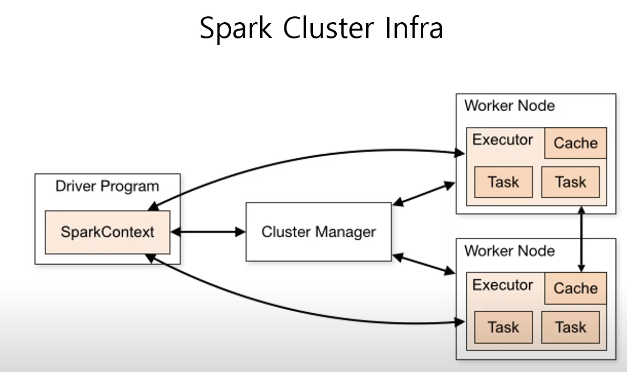

### Spark 란?

데이터 엔지니어링, 데이터 분석에서 사용되는 tool

<mark>Lightning-fast unified analytics engine</mark>

#### 특징

- 하둡보다 100배 빠르다. << 인메모리에서 작동하기 때문 (하둡은 디스크에서 작동)

- 사용하기 쉽다 
Java, <mark>Scala</mark>, Python, R, SQL을 지원한다. 
Scala가 메인이라 더 빠르긴 하다.

#### Process

<table>
<tbody>
  <tr>
    <td>Spark SQL &amp; Shark</td>
    <td>Spark Streaming</td>
    <td>MLlib</td>
    <td>GraphX</td>
  </tr>
  <tr>
    <td colspan="4">Spark Core</td>
  </tr>
  <tr>
    <td>Standalone Scheduler</td>
    <td>YARN</td>
    <td>Mesos</td>
    <td></td>
  </tr>
</tbody>
</table>

* Spark SQL : Dataframe, Datasets, RDD 중, Dataframe에 SQL을 사용해서 쿼리하거나 수정하는 역할
* MLlib : ML용 lib이 들어있음, tensor/keras 등을 사용하기 위해서는 Spark 위에 설치해서 사용가능
* Resource Manager : Standalone Scheduler, YARN, Mesos 
물리적으로 여러 대의 컴퓨터에 나뉘어 있는 자원(Cluster)를 어떻게 관리할지 결정 
    * Standalone Scheduler : Spark의 기본 리소스 매니저
    * YARN : 여러 대의 서버를 관리할 경우 주로 사용하는 리소스 매니저, Hadoop의 에코시스템 내에 있는 리소스 매니저

#### Cluster?

여러 대의 컴퓨터의 자원을 하나의 컴퓨터처럼 사용하는 방법론

Master - Slave 구조로 이루어져있다. (1:m)

* Driver Program : master의 역할, SparkContext는 메인 함수가 실행이 되는 구조, excutor의 매니징 역할도 포함
* Worker node : Slave의 역할
* Cluster Manager : 리소스의 managing 역할 (Standalone, Mesos, Yarn)
